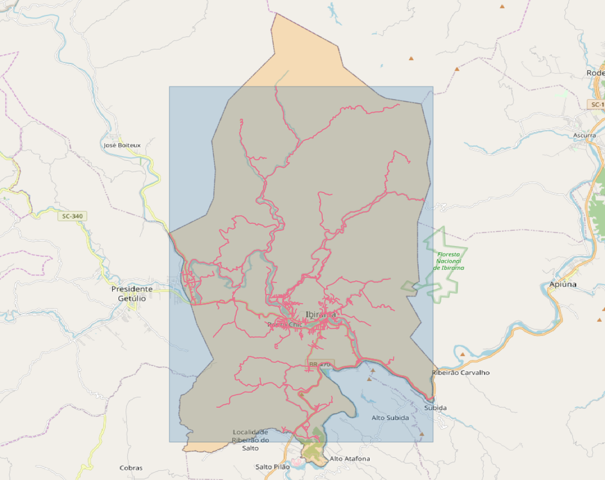


<!-- Visualizador online: https://stackedit.io/ -->
 

# Simulação da Propagação de COVID-19 em Ibirama

O objetivo desta [simulação com agentes](https://sites.google.com/view/simulacoescomagentes/) é estudar a propagação de COVID-19 na cidade de Ibirama/SC em diferentes cenários de isolamento social. Nesta simulação é criado um ***agente artificial (virtual)*** para cada habitante. Estes agentes reproduzem o comportamento diário dos habitantes de ir para o trabalho e/ou para instituição de ensino e então retornar para suas residências. Enquanto permanece no trabalho, escola, ou até mesmo em casa, um agente saudável pode ter contato com agente(s) infectado(s), ocasionando a propagação da doença. É possível simular o isolamento social **total** ou **setorial** (por exemplo, o isolamento apenas de estudantes ou trabalhadores) para verificar o efeito que estas medidas de isolamento podem causar na curva de contaminação do COVID-19.  

A simulação foi desenvolvida no âmbito do projeto de pesquisa [Desenvolvimento Dirigido a Modelos de Simulações com Agentes](https://www.udesc.br/ceavi/pesquisaepos/pesquisa/projetos) do [Centro de Educação Superior do Alto Vale do Itajaí (CEAVI/UDESC)](https://www.udesc.br/ceavi). Os autores da simulação são:

 - [**Lucas de Castro Lima Teixeira**](mailto:email-do-lucas@dominio.com) (aluno de Engenharia de Software e bolsista de pesquisa).
 - [**Fernando dos Santos**](mailto:fernando.santos@udesc.br) (professor no curso de Engenharia de Software).

A simulação foi desenvolvida na plataforma [NetLogo](https://ccl.northwestern.edu/netlogo/), e pode ser visualizada na Figura 1.

>Figura 1: Simulação de Propagação de COVID-19 em Ibirama/SC

Os dados utilizados na simulação são provenientes das seguintes fontes (apresentadas em detalhes mais abaixo):
- Os dados territoriais e viários foram obtidos do repositório [Open Street Map](https://www.openstreetmap.org/relation/296728).
- Os dados populacionais e domiciliares foram obtidos do [portal do IBGE](https://cidades.ibge.gov.br/brasil/sc/ibirama/panorama).
- Os dados educacionais foram obtidos do [portal do IBGE](https://cidades.ibge.gov.br/brasil/sc/ibirama/panorama) e também do portal [Educa Mais Brasil](https://www.educamaisbrasil.com.br/escolas/santa-catarina/ibirama).
- Os dados empresariais foram obtidos da [Federação Catarinense de Municípios (FECAM)](https://static.fecam.net.br/uploads/72/arquivos/1444231_Relatorio_Empresas_Ibirama.pdf).
- Os parâmetros da COVID-19 (ex: taxa de transmissão, duração, mortalidade) foram obtidos da literatura científica especializada.

É **muito importante** destacar que outros dados  **necessários** à simulação mas que **não estão disponíveis** nas fontes de dados acima (como por exemplo, a quantidade de funcionários de cada empresa ou de alunos em cada escola) foram **estimados**. Neste sentido, ressaltamos que a simulação **pode não refletir a dinâmica real de propagação de COVID-19 na cidade** e portanto seus resultados devem ser utilizados **com cautela**.  

# Sumário
* [Especificação da Simulação](#Especificação-da-Simulação)
	* [Territorial e Viária](#Territorial-e-Viária)
	* [População e Domicílios](#População-e-Domicílios)
	* [Empresas e Trabalhadores](#Empresas-e-Trabalhadores)
	* [Instituções de Ensino e Alunos](#Instituções-de-Ensino-e-Alunos)
	* [Comportamento dos Agentes](#Comportamento-dos-Agentes)
	* [Parâmetros da COVID-19](#Parâmetros-da-COVID-19)
* [Resultados Preliminares](#Resultados-Preliminares)
* [Referências](#Referências)

# Especificação da Simulação
## Territorial e Viária
Os dados territoriais e viários foram obtidos do repositório [Open Street Map](https://www.openstreetmap.org/relation/296728) em Março de 2020. A Figura 2 apresenta uma visualização do mapa utilizado. A estrutura viária está em vermelho. Os limites territoriais de Ibirama estão destacados em bege. Na simulação foi utilizado apenas a extensão territorial onde há ruas, destacada pelo retângulo azul. Essa extensão tem aproximadamente 21.44 km de altura por 14.36 km de largura.

>Figura 2: Mapa Territorial e Viário de Ibirama

O NetLogo utiliza uma grade para representar o território por onde os agentes se movimentam (e onde estão localizadas as casas, escolas e empresas). Em nossa simulação definimos uma grade de acordo com a extensão territorial da cidade. A grade utilizada contém  2144 células de altura e 1436 células de largura, e portanto cada célula representa um retângulo de 10 x 10 metros do território de Ibirama.

## População e Domicílios
## Empresas e Trabalhadores
## Instituções de Ensino e Alunos
## Comportamento dos Agentes
Os agentes na simulação possuem três tipos, sendo estes estudantes, trabalhadores e aqueles que se mantêm o tempo todo em casa. Podendo haver uma combinação de tipos, ex.: trabalhador e estudante.

Os **estudantes** são divididos em alunos do ensino infantil, fundamental, médio, superior e de jovens/adultos. Seu comportamento é organizado da seguinte forma:
- Movem-se para a instituição de  ensino no início do seu turno (matutino ou vespertino ou norturno).
- Agentes contaminados propagam a doença na instituição de ensino (uma única vez no turno).
- Voltam para casa ao fim do turno, ou caso sejam trabalhadores se movem para o local de trabalho.
- Agentes contaminados propagram a doença em casa (uma única vez, até o início do próximo turno).

Caso os estudantes sejam do ensino infantil, estes agentes permanecem na instituição de educação infantil durante o horário de trabalho dos pais e retornam para casa ao fim do turno vespertino.

Os **agentes trabalhadores** se comportam de modo que:
- Movem-se para a empresa no início do turno matutino.
- Agentes contaminados propagam a doença para outras pessoas da empresa (uma única vez durante os dois turnos).
- Voltam para casa ao fim do turno vespertino.
- Agentes contaminados propagam a doença em casa (uma única vez, até o início do próximo turno).

Caso o agente também seja um **estudante matutino** ou **vespertino**, ele trabalha durante 1 turno oposto ao seu horário escolar.

**Agentes não economicamente ativos** são aqueles agentes que não trabalham nem estudam, portanto:
- Estes agentes permanecem em casa o tempo todo.
- Se estiverem contaminados, então propagam a doença em casas uma única vez no dia(ex.: durante a "noite").

## Parâmetros da COVID-19

# Resultados Preliminares

>No gráfico abaixo: propagação entre **todos os habitantes** com isolamento setorial (0% estudantes e 10% trabalhadores)

/isolation(0.0s_0.1w)/all-chart.png)

>No gráfico abaixo: propagação entre **estudantes** com isolamento setorial (0% estudantes e 10% trabalhadores)

/isolation(0.0s_0.1w)/students-chart.png)

>No gráfico abaixo: propagação entre **trabalhadores** com isolamento setorial (0% estudantes e 10% trabalhadores)

/isolation(0.0s_0.1w)/workers-chart.png)

>No gráfico abaixo: propagação entre **não estudantes e não trabalhadores** com isolamento setorial (0% estudantes e 10% trabalhadores)

/isolation(0.0s_0.1w)/others-chart.png)

# Referências
